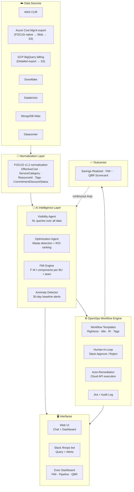

# KostOps — Agentic FinOps Platform

> **The open-source FinOps platform that finds cloud waste, scores financial maturity, and remediates — with humans in the loop.**

[](https://www.finops.org)
[](https://aws.amazon.com/bedrock/)
[](https://openops.com)
[](LICENSE)

🚀 **Live Demo**: [https://d2mth6oqewcm06.cloudfront.net](https://d2mth6oqewcm06.cloudfront.net)

---

## What is KostOps?

KostOps is a self-hosted, AI-native FinOps platform that gives engineering and finance teams a single place to **discover cloud waste, prioritize savings, approve remediations via Slack, and track FinOps maturity** — across every cloud.

Think of it as a **credit score system for cloud spending**: one FMI score (0–100) per business unit tells leadership exactly where money is being wasted and whether things are getting better or worse.

```
Ask a question in chat       Slack: "Approve rightsizing?"      Cloud resource resized
        │                              │                                  │
        ▼                              ▼                                  ▼
  AI Visibility Agent  ──►  OpenOps Workflow Engine  ──►  AWS / Azure / GCP API
        │                              │                                  │
        └──────────── FMI updates ◄────── Savings realized ────────┘
```

---

## The Problem KostOps Solves

| Without KostOps | With KostOps |
|---|---|
| Cost data locked in each cloud's billing console | Unified view across AWS, Azure, GCP, Snowflake, Databricks |
| Manual analysis by FinOps engineers | AI agents discover waste 24/7 automatically |
| Recommendations nobody acts on | Slack-native approval → one click to approve a fix |
| No way to measure FinOps maturity | FMI: a single 0–100 number per team |
| Month-end spreadsheet for leadership | Auto-generated QBR scorecard from live data |
| Siloed cost data per cloud account | FOCUS v1.2 normalized schema — single standard across all providers |

---

## Architecture at a Glance



---

## FinOps Maturity Index (FMI) — maturity in one number

> **Original KostOps framework.** FMI is distinct from the [Apptio COIN metric](#apptio-coin--cost-optimization-index-number) — see below.

| Score | Band | Meaning |
|---|---|---|
| 80–100 | 🟢 Optimized | FinOps excellence. Peer benchmark standard. |
| 60–79 | 🔵 Established | Good practice. Continuous improvement. |
| 40–59 | 🟠 Developing | Active optimization program needed. |
| 0–39 | 🔴 Critical | Immediate intervention required. |

**C** — Cost visibility (25 pts): tagging compliance, spend allocation, anomaly coverage  
**O** — Optimization realized (35 pts): idle resources eliminated, RI coverage, rightsizing actions taken  
**I** — Innovation adoption (20 pts): serverless %, managed services, automation rate  
**N** — Normalize governance (20 pts): budget adherence, unit cost trend, policy violations  

---

## Apptio COIN — Cost Optimization Index Number

KostOps also tracks the established **Apptio COIN** metric alongside FMI. These are complementary, not competing.

```
COIN = Optimization Opportunities ($) ÷ Total Amortized Spend ($)
```

**Lower is better.** Target: ≤ 0.20 (no more than 20% of spend should be identified waste).

| Metric | KostOps FMI | Apptio COIN |
|---|---|---|
| What it measures | FinOps maturity behaviours | Waste as % of total spend |
| Direction | Higher = better (0→100) | Lower = better (ratio) |
| Audience | Engineering teams + exec | FinOps team + finance |
| Cadence | Daily automated | Monthly typical |

> Reference: [FinOps KPI — What is COIN and How do I use it?](https://community.ibm.com/community/user/blogs/apptio-community-member/2024/09/26/finops-kpi-what-is-coin-and-how-do-i-use-it) — Kenny Shepard, Apptio (IBM), September 2024  
> Full detail: [docs/FMI.md — Disambiguation section](docs/FMI.md#disambiguation-fmi-vs-apptio-coin)


## Documentation

| Document | Description |
|---|---|
| [Architecture — Level 300](docs/ARCHITECTURE.md) | Full technical architecture: FOCUS normalization, file-based connectors, AI agents, API layer, 6 ADRs |
| [Multi-Cloud Connectors](docs/CONNECTORS.md) | AWS CUR 2.0, Azure FOCUS export, GCP BigQuery, Snowflake, Databricks — setup, SQL, and FOCUS mapping |
| [User Flow: Ask → Remediate](docs/USER_FLOW.md) | Step-by-step: from a user question to a cloud resource being fixed and savings recorded |
| [OpenOps Integration](docs/OPENOPS.md) | Workflow automation engine: templates, Slack approvals, remediation patterns |
| [FMI — FinOps Maturity Index](docs/FMI.md) | KostOps original 0–100 maturity score — and how it differs from Apptio COIN |
| [Deployment Guide](docs/DEPLOYMENT.md) | How to deploy KostOps in your AWS account |

---

## Quick Start

```bash
# Clone and deploy to your AWS account
git clone https://github.com/udaykirannag2/kostops
cd kostops
npm install
npx cdk deploy --all
```

See [Deployment Guide](docs/DEPLOYMENT.md) for full setup including multi-account AWS, Azure SP, GCP SA, Snowflake user, and Databricks PAT configuration.

---

## Supported Platforms

| Platform | Billing source | Mechanism | FOCUS native? |
|---|---|---|---|
| ✅ AWS | Cost and Usage Report (CUR 2.0) | Parquet pushed to S3 — Glue Crawler reads | ✅ Native FOCUS export available |
| ✅ Azure | Cost Management export | FOCUS CSV pushed to Blob Storage → copied to S3 | ✅ Native FOCUS export |
| ✅ GCP | BigQuery detailed billing export | BigQuery Storage API → S3 (no API polling) | 🔄 FOCUS converter |
| ✅ Snowflake | ACCOUNT_USAGE schema | MCP (real-time) + scheduled SQL export (batch) | 🔄 Manual mapping |
| ✅ Databricks | system.billing tables | MCP (real-time) + Delta export (batch) | 🔄 Manual mapping |
| ✅ MongoDB Atlas | Invoices API | Scheduled Lambda pull | ❌ Custom mapping |
| ✅ Datacenter | CMDB / chargeback | ServiceNow agent | ❌ Custom mapping |

---

## Built With

- **AI**: Claude (Anthropic) on Amazon Bedrock via AWS Strands Agents
- **Workflow Automation**: [OpenOps](https://openops.com) — open-source no-code FinOps automation  
- **Infrastructure**: AWS CDK (Lambda, DynamoDB, Athena, S3, Glue, Cognito, API Gateway)
- **Frontend**: React + Recharts + Tailwind CSS
- **Aligned to**: [FinOps Foundation](https://www.finops.org) Inform → Optimize → Operate lifecycle

---

## License

MIT — see [LICENSE](LICENSE)
