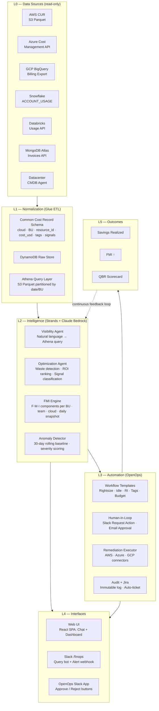
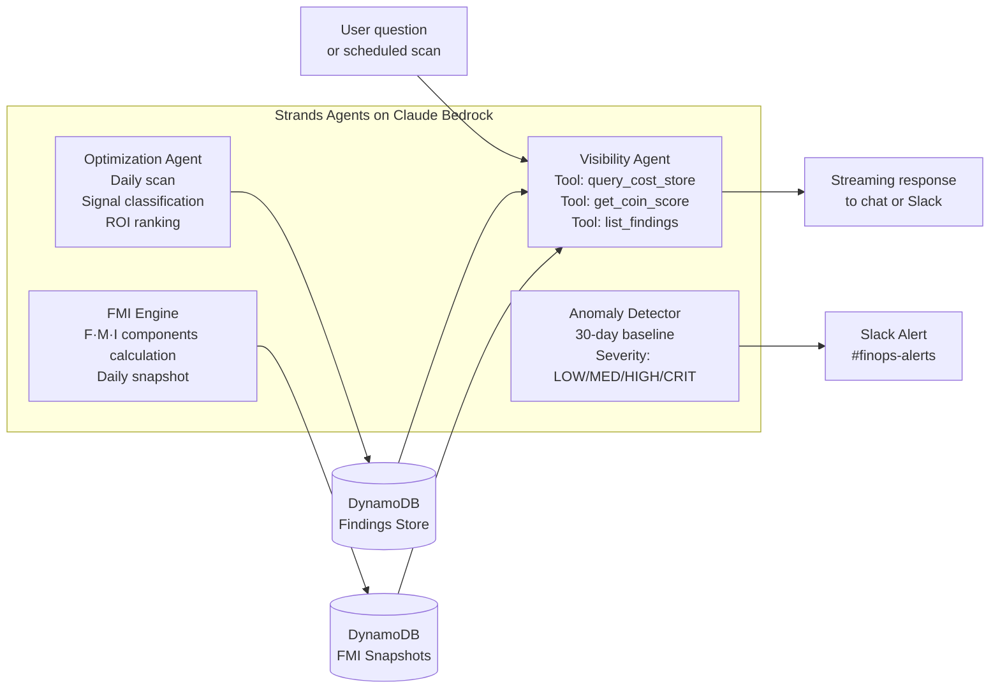
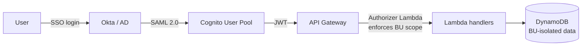

# Architecture — Level 300

> Full technical architecture of KostOps extended for enterprise multi-cloud FinOps.

---

## Five-Layer Architecture

---

## Normalization — Common Cost Record Schema

All 7 connectors emit to one schema. The AI agent and FMI engine never speak cloud-native formats.

| Field | Type | Description |
|---|---|---|
| `record_id` | STRING (PK) | SHA-256 of cloud + resource_id + date. Enables idempotent upserts. |
| `cloud` | ENUM | `aws` · `azure` · `gcp` · `snowflake` · `databricks` · `mongodb` · `datacenter` |
| `business_unit` | STRING | Derived from tag mapping: OptumHealth · OptumRx · OptumInsight · Shared |
| `product_family` | STRING | Internal product name from resource tag `product` |
| `environment` | ENUM | `prod` · `staging` · `dev` · `sandbox` |
| `resource_id` | STRING | Provider-native ID (ARN, Azure resource ID, GCP resource name) |
| `service_category` | ENUM | `compute` · `storage` · `networking` · `database` · `analytics` · `ai_ml` |
| `cost_usd` | DECIMAL(12,6) | Unblended cost in USD. FX conversion at ingestion. |
| `usage_quantity` | DECIMAL(20,6) | Native units (vCPU-hours, GB-months, credits, DBUs) |
| `tag_completeness_score` | DECIMAL(3,2) | 0.0–1.0. Fraction of required tags present. Feeds FMI C-component. |
| `optimization_signals` | JSON ARRAY | `[{signal_type, severity, estimated_savings_usd, description}]` |
| `coin_contribution` | JSON | `{C: float, O: float, I: float, N: float}` per record |

---

## Intelligence Layer — Agent Architecture

### Optimization signal types

| Signal | Trigger condition | Typical savings |
|---|---|---|
| `IDLE_RESOURCE` | <5% CPU for 14+ days | $500–$5K/resource/yr |
| `UNATTACHED_VOLUME` | No attachment for 7+ days | $10–$200/volume/yr |
| `RI_OPPORTUNITY` | On-demand pattern matches RI profile at >80% confidence | 20–40% of compute spend |
| `RIGHTSIZE_COMPUTE` | Memory or CPU <40% of provisioned for 30 days | 30–50% per instance |
| `SNOWFLAKE_IDLE_WAREHOUSE` | >60% idle time, no auto-suspend | $20K–$200K/warehouse/yr |
| `DATABRICKS_NO_TERMINATE` | Cluster running >2hrs past last job | $5K–$50K/cluster/yr |
| `DATA_TRANSFER_ANOMALY` | Cross-region spike >200% of 30-day baseline | Varies |
| `BUDGET_BREACH_FORECAST` | ML forecast: budget breach >75% confidence within 14 days | Preventive |

---

## API Layer

| Endpoint | Method | Description |
|---|---|---|
| `/chat` | POST | Send message to Visibility Agent. Streaming SSE response. |
| `/findings` | GET | List optimization opportunities with filters: cloud, BU, severity, status. |
| `/findings/{id}/approve` | POST | Human-approve a finding → fires OpenOps webhook. Creates audit log + Jira ticket. |
| `/coin/scores` | GET | FMI scores by BU, cloud, time range. Returns time-series. |
| `/coin/leaderboard` | GET | Team-level FMI ranking with trend and top opportunity per team. |
| `/dashboard/summary` | GET | Single call: total spend, realized savings, FMI scores, top opportunities. |
| `/pipeline` | GET | Savings pipeline: Discovered → Prioritized → In-Flight → Realized. $ per stage. |
| `/slack/command` | POST | Slack slash command handler. HMAC-verified. Async response. |

### Auth model

**RBAC groups**: `platform-admin` · `bu-admin` · `engineer` · `exec-viewer` · `finance-viewer`  
BU isolation enforced at query layer — not just UI. OptumHealth engineers cannot query OptumRx data.

---

## Security & Compliance

| Control | Implementation |
|---|---|
| Encryption at rest | DynamoDB AWS-managed AES-256 · S3 SSE-S3 |
| Encryption in transit | TLS 1.2+ enforced on all API Gateway endpoints |
| Secrets management | All cloud provider credentials in AWS Secrets Manager. Rotated quarterly. Never in env vars or code. |
| Network isolation | Lambda functions in private VPC subnets. No public endpoints except API Gateway (WAF-protected). |
| Audit logging | Every API mutation → CloudWatch + DynamoDB audit table. 1-year retention. SIEM export via Kinesis Firehose. |
| HIPAA | Cost data classified as Internal (not PHI). Data residency: all billing data stays in customer's AWS account. |

---

## Architecture Decision Records

### ADR-001: Self-hosted over SaaS
**Decision**: Build on KostOps open-source rather than purchase Apptio/CloudHealth/Flexera.  
**Rationale**: HIPAA data residency. SaaS tools at enterprise scale = $2M+/yr. FMI score and BU-specific logic not possible in SaaS.

### ADR-002: Normalize before intelligence
**Decision**: All 7 connectors emit to common schema before any AI analysis.  
**Rationale**: Enables cross-cloud queries, unified FMI score, and single agent without cloud-specific prompting.

### ADR-003: Human-in-loop for all remediation
**Decision**: No automated cloud write operations without explicit human approval.  
**Rationale**: Healthcare regulated environment. A misconfigured auto-remediation could affect systems supporting patient care. Risk is asymmetric.

### ADR-004: FMI score as primary exec metric
**Decision**: Single 0–100 score replaces ad-hoc savings spreadsheets for leadership communication.  
**Rationale**: A credit-score metaphor creates urgency, enables BU comparison, and tracks trend over time.

### ADR-005: OpenOps as remediation engine
**Decision**: OpenOps workflow automation over custom Lambda orchestration.  
**Rationale**: Pre-built FinOps templates, native Slack approval framework, no-code editor for PM-driven customization, self-hosted avoiding vendor lock.
