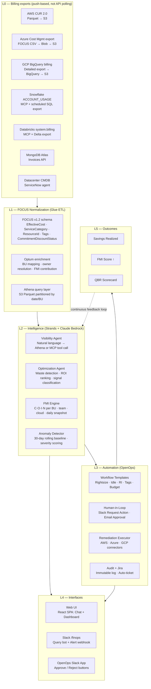
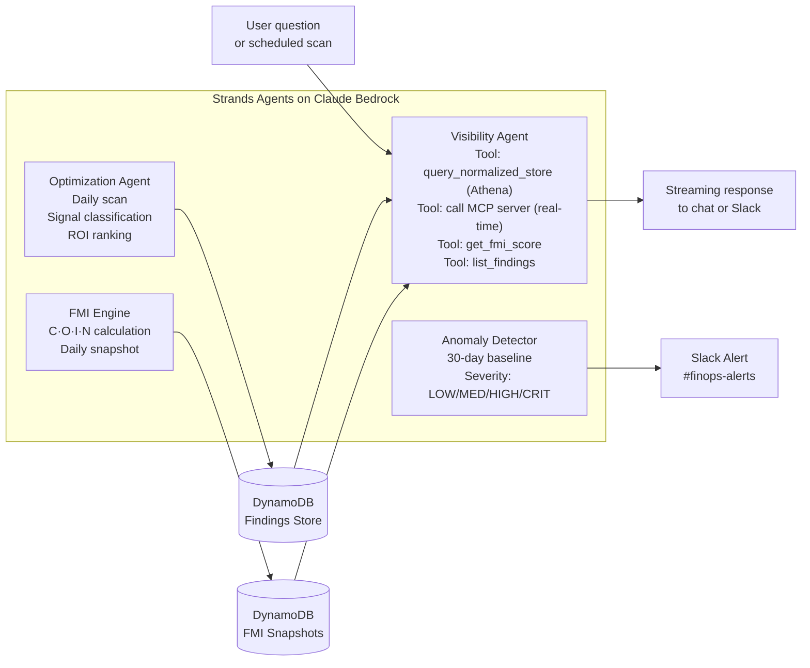
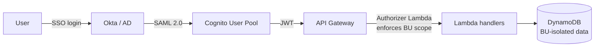

# Architecture — Level 300

> Full technical architecture of KostOps extended for enterprise multi-cloud FinOps.

---

## Five-Layer Architecture



---

## Connector Strategy: File Exports, Not API Polling

A key architectural decision: all bulk billing ingestion uses **provider-pushed file exports**, mirroring the AWS CUR pattern. API calls are reserved for MCP real-time queries only.

```
Cloud billing system pushes export → KostOps reads file/table → Glue ETL → FOCUS schema → Athena
```

| Platform | Export mechanism | Format | FOCUS native? |
|---|---|---|---|
| AWS | CUR 2.0 → S3 (payer account) | Parquet | ✅ Native FOCUS export available |
| Azure | Cost Management export → Blob Storage → S3 | CSV or **FOCUS native** | ✅ Native FOCUS export |
| GCP | BigQuery detailed billing export → BigQuery Storage API → S3 | BigQuery table → Parquet | 🔄 FOCUS converter (native coming) |
| Snowflake | ACCOUNT_USAGE scheduled SQL export → S3 (+ MCP for real-time) | SQL views → Parquet | 🔄 Manual mapping |
| Databricks | system.billing Delta export → S3 (+ MCP for real-time) | Delta tables → Parquet | 🔄 Manual mapping |

See [CONNECTORS.md](./CONNECTORS.md) for full setup details per platform.

---

## FOCUS Normalization — Replacing Custom ETL

All connectors output to **FOCUS v1.2** — the FinOps Open Cost & Usage Specification — before entering the normalized store. This replaces all custom provider-specific ETL transforms.

> FOCUS is an open standard ratified by the FinOps Foundation. AWS and Azure already export it natively. See [focus.finops.org](https://focus.finops.org) and the [FOCUS v1.2 spec](https://focus.finops.org/focus-specification/v1-2/).

### Key FOCUS columns used by KostOps

| FOCUS column | Type | KostOps use |
|---|---|---|
| `EffectiveCost` | DECIMAL | Actual cost after discounts + RI/SP amortized. Primary cost metric for FMI. |
| `BilledCost` | DECIMAL | Invoice cost — used for Apptio COIN ratio numerator. |
| `ServiceCategory` | ENUM | Normalized: Compute / Storage / Network / Database / AI-ML across all providers. Enables cross-cloud grouping with zero mapping logic. |
| `ServiceName` | STRING | Provider service name (e.g. "Amazon EC2"). Rolls up under `ServiceCategory`. |
| `ResourceId` | STRING | Unique resource identifier — used as owner lookup key against CMDB. |
| `SubAccountId` | STRING | AWS account / Azure subscription / GCP project. BU attribution layer 1. |
| `Tags` | MAP | All resource tags. `tag_completeness_score` derived here → FMI C-component. |
| `CommitmentDiscountStatus` | ENUM | Whether charge was covered by RI/SP/CUD. Replaces provider-specific discount columns. FMI O-component RI coverage. |
| `ChargeCategory` | ENUM | Usage / Purchase / Tax / Credit — filter out non-usage charges cleanly. |
| `BillingPeriodStart/End` | DATETIME | Standard billing period bounds — consistent partitioning across all providers. |

### Optum enrichment layer (post-FOCUS)

After FOCUS normalization, two Optum-specific enrichment steps run:

**1. BU mapping**: `SubAccountId` → `business_unit` via a config table mapping account IDs to OptumHealth / OptumRx / OptumInsight / Shared Services.

**2. Owner resolution** (four-signal waterfall):
```
1. Tags[owner] tag → direct email attribution
2. SubAccountName pattern → BU + team from naming convention (e.g. optumrx-claims-prod)
3. CMDB (ServiceNow) API lookup using ResourceId → application owner, service owner
4. AI inference → CloudTrail/Activity Log principal analysis for untagged dark spend
         → writes as kostops:inferred_owner with confidence score
```

---

## Intelligence Layer — Agent Architecture



### Agent tool routing — when to use Athena vs MCP

| Query type | Tool called | Why |
|---|---|---|
| "What is OptumRx FMI score this quarter?" | Athena (normalized store) | Needs cross-platform join + 90-day history |
| "Why did Snowflake spend spike 3 hours ago?" | Snowflake MCP | Needs live ACCOUNT_USAGE — minutes old |
| "Show total cloud spend by BU this month" | Athena (normalized store) | Cross-cloud FOCUS join across all platforms |
| "What's our current AWS budget vs actuals?" | AWS Billing MCP | Live budget API, not in yesterday's batch |
| "Which team has the worst COIN ratio?" | Athena (normalized store) | Needs all-platform aggregation |
| "Who ran the most expensive Databricks job today?" | Databricks MCP | Live system.billing.usage |

### Optimization signal types

| Signal | Trigger condition | Typical savings |
|---|---|---|
| `IDLE_RESOURCE` | <5% CPU for 14+ days | $500–$5K/resource/yr |
| `UNATTACHED_VOLUME` | No attachment for 7+ days | $10–$200/volume/yr |
| `RI_OPPORTUNITY` | On-demand pattern matches RI profile at >80% confidence | 20–40% of compute spend |
| `RIGHTSIZE_COMPUTE` | Memory or CPU <40% of provisioned for 30 days | 30–50% per instance |
| `SNOWFLAKE_IDLE_WAREHOUSE` | >60% idle time — FOCUS `EffectiveCost` vs attributed query cost delta | $20K–$200K/warehouse/yr |
| `DATABRICKS_NO_TERMINATE` | Cluster running >2hrs past last job in system.billing | $5K–$50K/cluster/yr |
| `DATA_TRANSFER_ANOMALY` | Cross-region spike >200% of 30-day FOCUS baseline | Varies |
| `BUDGET_BREACH_FORECAST` | ML forecast: breach >75% confidence within 14 days | Preventive |

---

## API Layer

| Endpoint | Method | Description |
|---|---|---|
| `/chat` | POST | Send message to Visibility Agent. Streaming SSE response. |
| `/findings` | GET | List optimization opportunities with filters: cloud, BU, severity, status. |
| `/findings/{id}/approve` | POST | Human-approve a finding → fires OpenOps webhook. Creates audit log + Jira ticket. |
| `/fmi/scores` | GET | FMI scores by BU, cloud, time range. Returns time-series. |
| `/fmi/leaderboard` | GET | Team-level FMI ranking with trend and top opportunity per team. |
| `/dashboard/summary` | GET | Single call: total spend, realized savings, FMI scores, top opportunities. |
| `/pipeline` | GET | Savings pipeline: Discovered → Prioritized → In-Flight → Realized. $ per stage. |
| `/slack/command` | POST | Slack slash command handler. HMAC-verified. Async response. |

### Auth model



**RBAC groups**: `platform-admin` · `bu-admin` · `engineer` · `exec-viewer` · `finance-viewer`

BU isolation enforced at query layer — not just UI. OptumHealth engineers cannot query OptumRx data.

---

## Security & Compliance

| Control | Implementation |
|---|---|
| Encryption at rest | DynamoDB AWS-managed AES-256 · S3 SSE-S3 |
| Encryption in transit | TLS 1.2+ enforced on all API Gateway endpoints |
| Secrets management | All cloud credentials (Azure SP, GCP SA key, Snowflake password, Databricks PAT) in AWS Secrets Manager. Rotated quarterly. Never in env vars or code. |
| Network isolation | Lambda functions in private VPC subnets. No public endpoints except API Gateway (WAF-protected). |
| Audit logging | Every API mutation → CloudWatch + DynamoDB audit table. 1-year retention. SIEM export via Kinesis Firehose. |
| HIPAA | Cost data classified as Internal (not PHI). Data residency: all billing data stays in customer's AWS account. Azure exports copied to Optum S3 — never stored in third-party SaaS. |

---

## Architecture Decision Records

### ADR-001: Self-hosted over SaaS
**Decision**: Build on KostOps open-source rather than purchase Apptio/CloudHealth/Flexera.
**Rationale**: HIPAA data residency. SaaS tools at enterprise scale = $2M+/yr. FMI score and BU-specific logic not possible in SaaS.

### ADR-002: FOCUS as normalization schema
**Decision**: Adopt FOCUS v1.2 as the normalization schema, replacing custom provider-specific ETL.
**Rationale**: AWS and Azure emit FOCUS natively — zero ETL for those two providers. Open standard maintained by FinOps Foundation — schema updates come from the community, not internal sprints. GCP and Databricks covered by open-source FOCUS converters.
**Trade-off**: GCP native FOCUS support not yet complete. Mitigated by FinOps Foundation converter library.

### ADR-003: File-based exports over API polling for bulk ingestion
**Decision**: All bulk billing ingestion uses provider-pushed file exports (CUR, Azure export, BigQuery), not REST API polling.
**Rationale**: No rate limits, no pagination, no auth token rotation, complete daily datasets. Mirrors the proven AWS CUR pattern across all providers. API calls (MCP) reserved for real-time conversational queries only.
**Trade-off**: Azure exports have 24–72hr billing lag. Mitigated by 3-day lookback window with upsert on ResourceId + date.

### ADR-004: Human-in-loop for all remediation
**Decision**: No automated cloud write operations without explicit human approval.
**Rationale**: Healthcare regulated environment. Risk is asymmetric — a misconfigured auto-remediation could affect systems supporting patient care.

### ADR-005: FMI as primary executive metric (distinct from Apptio COIN)
**Decision**: Introduce FMI (FinOps Maturity Index, 0–100, higher = better) alongside Apptio COIN ratio (lower = better).
**Rationale**: FMI measures maturity behaviours. COIN measures waste ratio. Both tracked — see [FMI.md](./FMI.md#disambiguation-fmi-vs-apptio-coin).

### ADR-006: OpenOps as remediation engine
**Decision**: OpenOps workflow automation over custom Lambda orchestration.
**Rationale**: Pre-built FinOps templates, native Slack approval framework, no-code editor for PM-driven customization, self-hosted avoiding vendor lock.
