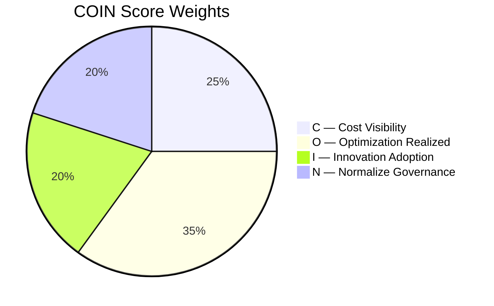
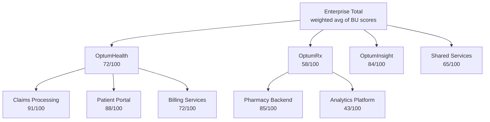

# COIN Score — FinOps Maturity Index

> A single 0–100 score per business unit, team, and cloud platform that makes cloud financial health as readable as a credit score.

---

## Why COIN?

Raw cloud spend numbers don't drive executive action. A BU spending $4M/month doesn't tell you if that's good or bad. The COIN score answers the question executives actually care about: **are we getting better or worse at managing cloud spend?**

Like a credit score, COIN:
- Converts complex behavior into a single number anyone can understand
- Enables comparison across teams and BUs
- Tracks trend over time — direction matters as much as level
- Creates urgency without requiring CFO-level cloud expertise

---

## Score Bands

| Score | Band | Color | Meaning |
|---|---|---|---|
| 80–100 | Optimized | 🟢 | FinOps excellence. Peer benchmark standard. |
| 60–79 | Established | 🔵 | Good practice. Continuous improvement in place. |
| 40–59 | Developing | 🟠 | Active optimization program needed. |
| 0–39 | Critical | 🔴 | Immediate intervention required. |

---

## Component Breakdown



### C — Cost Visibility (25 points)

*Can we see where the money is going?*

| Sub-metric | Weight | Measurement |
|---|---|---|
| Tag completeness | 40% | % of resources with all required Optum tags present |
| Spend allocation | 30% | % of total spend allocated to a known BU/product (vs "dark spend") |
| Anomaly coverage | 30% | % of resources enrolled in anomaly detection monitoring |

**Example**: 85% tag compliance + 92% spend allocated + 100% anomaly coverage → C = 21.2 / 25

---

### O — Optimization Realized (35 points)

*Are we actually fixing the waste we find?*

This is the hardest component to inflate — it requires real action, not just identifying problems.

| Sub-metric | Weight | Measurement |
|---|---|---|
| Idle resource remediation rate | 40% | % of identified idle resources addressed within 30 days |
| RI/SP coverage vs recommended | 30% | Actual coverage ÷ KostOps-recommended coverage |
| Rightsizing actions completed | 30% | Rightsizing actions taken ÷ recommendations made in last 90 days |

**Example**: 45% idle remediation + 78% RI coverage + 60% rightsizing → O = 19.6 / 35

---

### I — Innovation Adoption (20 points)

*Are we using cloud efficiently, not just cheaply?*

| Sub-metric | Weight | Measurement |
|---|---|---|
| Managed/serverless % | 40% | % of workloads on managed services vs self-managed EC2/VM |
| Automation rate | 30% | % of optimization actions executed without human touch (auto-approve threshold met) |
| AI/ML service adoption | 30% | AI/ML spend as % of total compute spend |

**Example**: 38% serverless + 25% automation + 15% AI spend → I = 13.2 / 20

---

### N — Normalize Governance (20 points)

*Are we staying within budget and improving unit economics?*

| Sub-metric | Weight | Measurement |
|---|---|---|
| Budget adherence | 40% | 1 - max(0, (actual - forecast) / forecast). Penalizes overruns. |
| Unit cost trend | 30% | $/claim or $/member-month. Decreasing = good. Uses 90-day regression slope. |
| Policy violation rate | 30% | 1 - (violations / total resources). Tagging, naming, approved regions. |

**Example**: 8% budget overrun + unit cost flat + 3% violation rate → N = 14.1 / 20

---

## Granularity

COIN scores are computed at three levels daily:



---

## Storage Schema

```sql
-- DynamoDB table: optum-coin-scores
-- Partition key: bu_id#cloud
-- Sort key: score_date (YYYY-MM-DD)

{
  "pk": "optumrx#all",
  "sk": "2025-06-15",
  "score": 58,
  "components": {
    "C": 14.2,
    "O": 20.8,
    "I": 11.1,
    "N": 11.9
  },
  "previous_score": 60,
  "trend": -2,
  "top_opportunity": {
    "signal": "SNOWFLAKE_IDLE_WAREHOUSE",
    "savings_usd": 180000
  }
}
```

---

## Using COIN in Executive Communication

### Monthly Business Review (MBR) scorecard

```
OptumHealth   ████████████████░░░░  72/100  ↑ +4 pts
OptumRx       ████████████░░░░░░░░  58/100  ↓ -2 pts  ⚠️ Action needed
OptumInsight  █████████████████░░░  84/100  ↑ +6 pts  ✅ Best practice
Shared Svcs   █████████████░░░░░░░  65/100  → 0 pts
```

### QBR narrative framing

> *"OptumRx dropped 2 points this quarter to 58 (Developing). The primary drag is the O-component at 21/35 — only 31% of identified optimization opportunities were acted on in 30 days. Two root causes: (1) Snowflake idle warehouse cleanup awaiting team lead approval for 45 days, (2) EC2 rightsizing workflow blocked by missing CMDB owner tags. Recommended actions: unblock Snowflake approval (recovers $180K/yr) and run a tagging sprint to fix owner attribution."*
