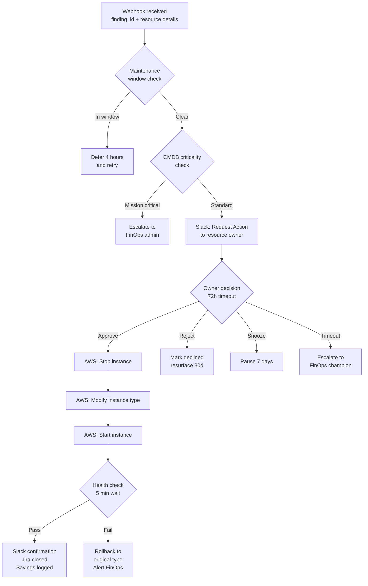
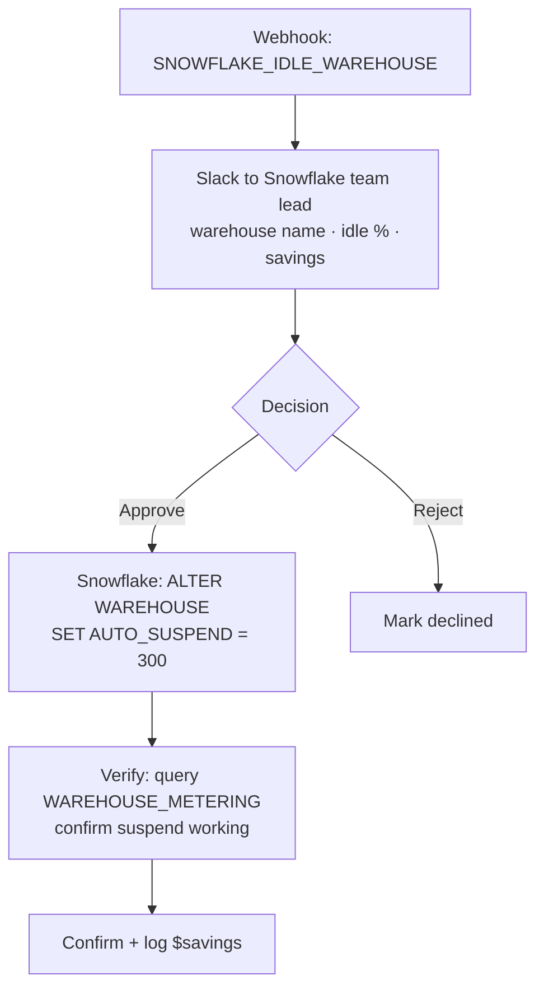
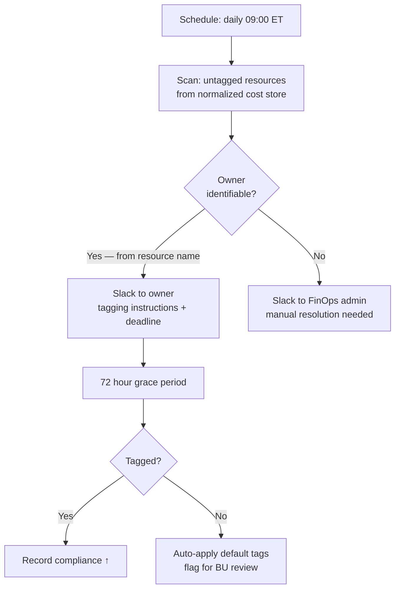

# OpenOps Integration — Workflow Automation Engine

> OpenOps is the remediation and governance layer. KostOps finds the waste. OpenOps fixes it — with humans in the loop.

---

## Why OpenOps?

| Requirement | Custom Lambda | OpenOps |
|---|---|---|
| Pre-built FinOps templates | ❌ Build from scratch | ✅ 20+ templates out of box |
| Slack approval buttons | ❌ Build Block Kit UI | ✅ Native Request Action block |
| No-code workflow editing | ❌ Code changes needed | ✅ Visual drag-and-drop editor |
| Jira auto-ticket | ❌ Custom integration | ✅ Native Jira block |
| Audit log per action | ❌ Custom CloudWatch | ✅ Built-in run history |
| Human escalation paths | ❌ Custom timeout logic | ✅ Built-in wait + branch |
| Self-hosted (HIPAA) | ✅ | ✅ Docker-based |

---

## Deployment

```bash
# Deploy OpenOps alongside KostOps in the same VPC
curl -fsS https://openops.sh/install | sh

# OpenOps runs at http://localhost/ by default
# For production: deploy on EC2 in private subnet, front with ALB
```

OpenOps connects to AWS, Azure, and GCP via its Connections vault. Credentials are stored separately from KostOps Secrets Manager but both reside within the Optum VPC.

---

## How KostOps Triggers OpenOps

When a user approves a finding, KostOps fires a webhook to OpenOps:

```
POST https://openops.internal/webhook/finops-trigger
{
  "finding_id": "f-001",
  "resource_id": "i-0abc123",
  "action_type": "RIGHTSIZE",
  "parameters": {
    "current_type": "m5.2xlarge",
    "target_type": "m5.large",
    "cloud": "aws",
    "region": "us-east-1",
    "account_id": "123456789"
  },
  "jira_ticket": "FIN-1047",
  "triggered_by": "uday@optum.com",
  "estimated_savings_usd": 8400
}
```

OpenOps receives this, matches it to the appropriate workflow template, and begins execution.

---

## Workflow Templates

### EC2 / VM Rightsizing



### Snowflake Idle Warehouse



### Tag Compliance (Scheduled)



---

## Slack Message Patterns

### Approval request (OpenOps → resource owner)

Uses OpenOps **Request Action** block — workflow pauses until button clicked.

```
┌──────────────────────────────────────────────────┐
│ FinOps Optimization Request                       │
│                                                   │
│ Instance:    i-0abc123 (m5.2xlarge)              │
│ Action:      Rightsize to m5.large               │
│ CPU avg:     12% over 30 days                    │
│ Savings:     $8,400/yr  │  Confidence: 94%       │
│ Jira:        FIN-1047                            │
│                                                   │
│ [✅ Approve]  [❌ Reject]  [⏸ Snooze 7 days]     │
└──────────────────────────────────────────────────┘
```

### Completion confirmation (OpenOps → owner + #finops-approvals)

```
✅ Rightsizing complete — i-0abc123

Before:  m5.2xlarge  →  After: m5.large
Savings: $8,400/yr realized
FMI O-score: +1.2 pts for OptumHealth
Jira FIN-1047: Closed

Approved by: @claims-team-lead at 14:32 UTC
```

### Anomaly alert (KostOps → #finops-alerts)

```
🚨 CRITICAL anomaly detected

Cloud:    GCP · OptumRx
Spike:    +340% vs 30-day baseline
Amount:   $28,400 above normal (today)
Service:  BigQuery · analytics-dataset

Investigate: /finops anomaly gcp optumrx
```

---

## Audit & Compliance

Every OpenOps workflow run is immutably logged:

| Field | Example |
|---|---|
| `run_id` | `run-2025-06-15-f001` |
| `workflow` | `EC2 Rightsizing` |
| `finding_id` | `f-001` |
| `resource_id` | `i-0abc123` |
| `action` | `ModifyInstanceAttribute` |
| `approved_by` | `claims-team-lead@optum.com` |
| `approved_at` | `2025-06-15T14:32:00Z` |
| `before_state` | `{instanceType: "m5.2xlarge"}` |
| `after_state` | `{instanceType: "m5.large"}` |
| `outcome` | `SUCCESS` |

Logs exported to Optum SIEM via Kinesis Firehose. 1-year retention required by HIPAA audit policy.
