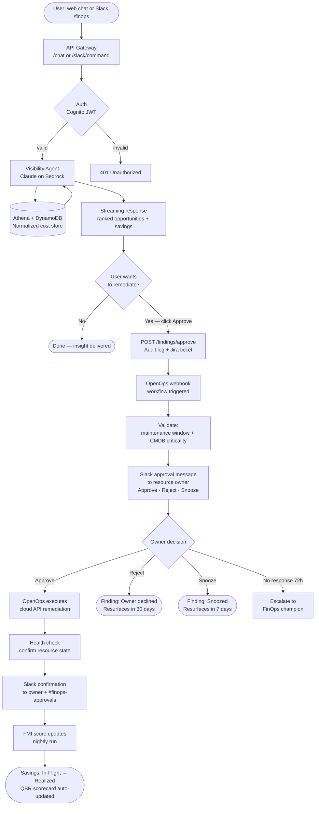
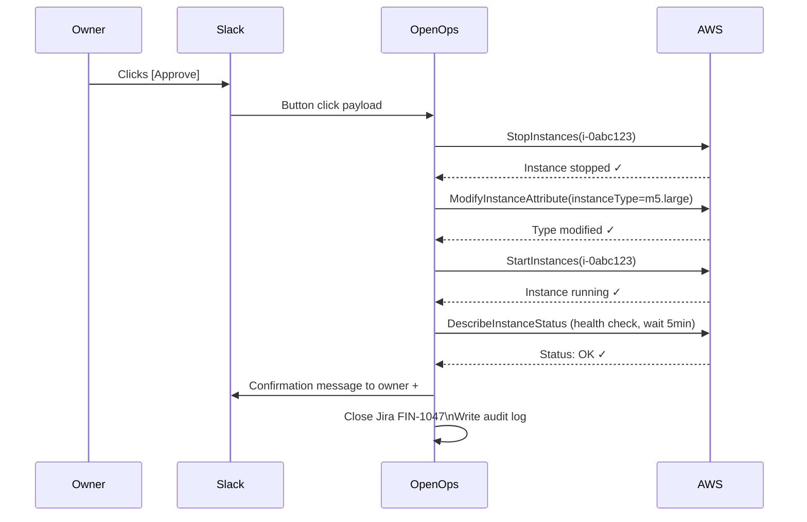

# User Flow — Ask → Discover → Approve → Remediate

> End-to-end flow from a user question to a cloud resource being fixed and savings recorded.

---

## Overview

KostOps has two entry points (web UI chat and Slack `/finops`) but one intelligence core. OpenOps handles all execution. Every remediation requires explicit human approval before any cloud API write is made.



---

## Step-by-Step Detail

### Step 1 — User input

The user asks a question. Both entry points hit the same backend.

```
Web UI:    "What are our top 3 rightsizing opportunities in OptumHealth?"
Slack:     /finops show rightsizing OptumHealth
```

**System**: `POST /chat` or `/slack/command` → API Gateway → Cognito JWT check → Lambda `chat-handler`

---

### Step 2 — Visibility agent queries data

The Visibility Agent (Claude on Bedrock via Strands) selects tools to answer the question.

```
Agent tool calls:
  query_normalized_cost_store(bu="OptumHealth", signal="RIGHTSIZE", limit=3)
  list_optimization_opportunities(type="rightsize", sort="savings_desc")
```

**Athena query generated:**
```sql
SELECT resource_id, instance_type, avg_cpu_pct, estimated_savings_usd, confidence
FROM cost_records
WHERE bu = 'OptumHealth'
  AND signal_type = 'RIGHTSIZE'
  AND usage_date >= CURRENT_DATE - INTERVAL '30' DAY
ORDER BY estimated_savings_usd DESC
LIMIT 3
```

---

### Step 3 — Agent streams response

The agent returns ranked opportunities. The dashboard panel updates simultaneously.

**Chat response (streaming):**
```
Top 3 rightsizing opportunities in OptumHealth:

1. i-0abc123 · m5.2xlarge → m5.large · CPU avg 12% · $8,400/yr · 94% confidence
2. i-0def456 · r5.4xlarge → r5.2xlarge · CPU avg 18% · $7,200/yr · 88% confidence  
3. i-0ghi789 · c5.xlarge → c5.large · CPU avg 22% · $3,600/yr · 91% confidence

Total potential savings: $19,200/yr
FMI O-score impact if acted on: +4 pts for OptumHealth

Want me to trigger a remediation workflow?
```

---

### Step 4 — User approves, OpenOps fires

User clicks **Approve all** in UI or types "yes, remediate all 3".

```
POST /findings/approve
{
  "finding_ids": ["f-001", "f-002", "f-003"],
  "triggered_by": "chat",
  "user": "uday@optum.com"
}
```

**System response:**
- Writes 3 immutable audit log entries
- Creates Jira tickets FIN-1047, FIN-1048, FIN-1049
- Fires OpenOps webhook for each finding

---

### Step 5 — OpenOps Slack approval

OpenOps receives the webhook, validates maintenance window and CMDB criticality, then sends a Slack approval message to the resource owner.

```
Slack DM to @claims-team-lead:

┌─────────────────────────────────────────┐
│ FinOps Optimization Request             │
│                                         │
│ Instance:  i-0abc123 (m5.2xlarge)       │
│ Action:    Rightsize to m5.large        │
│ CPU avg:   12% over 30 days             │
│ Savings:   $8,400/yr                    │
│ Confidence: 94%                         │
│ Jira:      FIN-1047                     │
│                                         │
│ [✅ Approve]  [❌ Reject]  [⏸ Snooze 7d] │
└─────────────────────────────────────────┘
```

**OpenOps waits** for button click. Timeout: 72 hours → escalate to BU FinOps champion.

---

### Step 6 — Remediation executes

Owner clicks **Approve**. OpenOps routes to the Approve branch of its conditional workflow.



---

### Step 7 — Savings realized, FMI updates

Next day's billing reflects the lower instance cost. The nightly FMI run picks up the completed optimization.

| What updates | Detail |
|---|---|
| Savings pipeline | In-Flight → Realized ($8,400/yr) |
| FMI O-component | +1.2 pts for OptumHealth |
| Team leaderboard | Claims Processing team rank improves |
| Jira | FIN-1047 auto-closed |
| Dashboard | Realized savings MTD counter increments |
| QBR scorecard | Auto-included in next monthly report |

---

## Flow Variants

### Reject path

```
Owner clicks [Reject]
  → OpenOps: Reject branch
  → Finding status: "Owner declined"
  → Resurfaces in findings store after 30 days
  → Audit log: decision + timestamp + owner ID
```

### No response (72h timeout)

```
No button click after 72 hours
  → OpenOps: escalate to BU FinOps champion via Slack
  → Additional 48h window
  → Still no response → auto-close "Unresponsive"
  → Flag for discussion in next MBR
```

### Proactive anomaly (no user prompt)

```
Anomaly Detector fires during nightly run
  → CRITICAL severity (spend +340% vs baseline)
  → OpenOps budget breach workflow fires automatically
  → Slack alert to BU finance owner + FinOps champion
  → If spend >120% forecast → soft provisioning block
  → No user query needed — fully automatic detection + notification
```

### Scheduled compliance sweep

```
OpenOps schedule: daily 09:00 ET
  → Scan untagged resources from normalized store
  → Slack notification to identified owners with tagging instructions
  → 72h grace period
  → Auto-apply default tags or quarantine resource
  → No individual user queries required
```

---

## Data Flow Reference

| From | To | Payload |
|---|---|---|
| User (chat/Slack) | API Gateway | User message + session_id + JWT |
| Lambda chat-handler | Visibility Agent (Bedrock) | Conversation history + query |
| Visibility Agent | Athena + DynamoDB | SQL query + findings filter params |
| Agent | User (SSE stream / Slack) | Ranked opportunities + savings estimates |
| User approval | POST /findings/approve | finding_ids + triggered_by + user_email |
| Lambda findings-handler | OpenOps webhook | {resource_id, action_type, params, jira_ticket} |
| OpenOps | Slack (Block Kit) | Approval message + Approve/Reject/Snooze buttons |
| Owner Slack click | OpenOps Wait For User Action | Button value: approve · reject · snooze |
| OpenOps (Approve branch) | AWS/Azure/GCP/Snowflake API | Resource modification command |
| Cloud API | OpenOps | Success/failure + new resource state |
| OpenOps | DynamoDB + Jira + Slack | Realized savings record + ticket close + confirmation |
